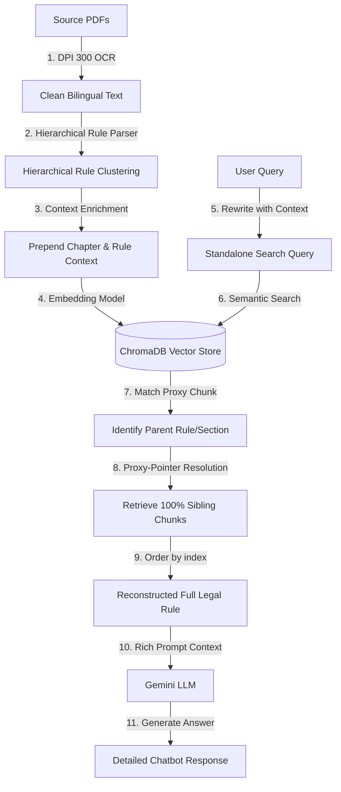

# 📚 Malayalam GST Book — Advanced RAG Assistant

An advanced, context-aware Retrieval-Augmented Generation (RAG) assistant designed to query complex, bilingual (Malayalam and English) GST regulatory text. This application utilizes high-fidelity OCR, hierarchical indexing, and the **Proxy-Pointer architecture** to deliver fully reconstructed legal section contexts to Gemini models without fragmentation.

---

## 📸 Application Gallery & Walkthrough

Here is a visual walkthrough of the Malayalam GST Book RAG Assistant in action, demonstrating the user interface and backend execution.

### 💬 1. Chatbot Interface & Intelligent QA
The Chatbot tab provides a clean, premium, ChatGPT-style chat interface for interactive querying. 

```carousel

<!-- slide -->

```

* **Interactive Conversations:** Users can query the database in Malayalam or English (e.g., asking about *വകുപ്പ് 4* or *Rules of Registration*).
* **Standalone Context Rewriting:** Behind the scenes, the chatbot takes previous chat history and rewrites follow-up questions into standalone queries before searching the vector database.
* **Professional Legal Drafting:** The assistant returns comprehensive, detailed answers, laying out sub-points clearly in the target language.

---

### ⚙️ 2. Database Builder & High-Fidelity OCR Pipeline
The Database Builder tab acts as an administrative console where the raw PDF files are ingested, OCR'd, structurally chunked, and embedded into the local vector store.

```carousel

<!-- slide -->

<!-- slide -->

```

* **High-Quality OCR Extraction:** Using Tesseract OCR configured for bilingual `mal+eng` text alongside a Poppler-backed renderer, pages are scanned at 300 DPI to preserve Malayalam character fidelity.
* **Status Updates & Progress Bars:** The builder provides real-time progress indicators showing page conversion, extraction counts, and chunk statistics.
* **Hierarchical Chunking & Cosine Embeddings:** The system automatically groups the extracted pages structurally into chapters/rules, pre-calculates cosine-space metrics, and uploads the documents in batches to ChromaDB.

---

## 🚀 Advanced RAG Techniques Implemented

Standard RAG architectures often suffer when querying legal and regulatory documents because simple sentence or token-based splitting fragments cohesive rules, sections, or chapters. To solve this, this pipeline implements three state-of-the-art RAG techniques:



### 1. 🗂️ Hierarchical Rule Clustering
Legal texts are structured into nested logical domains (Chapters $\rightarrow$ Rules/Sections $\rightarrow$ Sub-clauses). 
* **The Parser:** Our structural splitter (`chunk_all_pages_structurally`) scans the document text to parse active chapters (e.g., *അദ്ധ്യായം 4* / *Chapter IV*) and rules/sections (e.g., *ചട്ടം 10* / *Rule 10*).
* **The Cluster:** Every chunk generated is cataloged as a child under its parent rule/section. This forms database-level clusters where chunks are explicitly grouped under a unified legal segment, preserving the structural layout of the tax code.

### 2. 📝 Context Enrichment
If a chunk is embedded out of context, it loses the structural environment that defines its validity (e.g., "Registration must be done in 3 days" is meaningless without knowing *which* class of taxpayers it applies to).
* Before generating embeddings, we **prepend** metadata-driven headers directly into the text:
  ```text
  Context: Chapter: [Active Chapter Name] | Rule/Section: [Active Rule Name]
  [Cleaned Segment Text...]
  ```
* This context enrichment guarantees that the semantic space represents both the content *and* its structural location, resulting in vastly superior vector retrieval precision.

### 3. 🎯 Proxy-Pointer Architecture
Standard top-$k$ chunk retrieval retrieves disjointed paragraphs from different rules, creating a confusing "frankenstein" context for the LLM. We solve this using a **Proxy-Pointer** setup:
* **The Proxy:** We run a high-precision cosine semantic search over the enriched database to locate the top relevant chunks.
* **The Pointer:** Once target chunks are matched, we do not feed them directly to the LLM. Instead, we extract their `rule` metadata pointer.
* **Resolution & Reassembly:** The system triggers an immediate parent-query to fetch **100% of the chunks** matching that specific `rule` pointer. These chunks are sorted chronologically by their reading order (`chunk_index`), reassembling the complete rule in its original legal form.
* **The Result:** The LLM receives the full, continuous, uninterrupted text of the relevant tax rules.

---

## 🛠️ Technology Stack

* **Front-End:** Streamlit (Features a dual-tab clean UI: a ChatGPT-style Chatbot tab and an administrative Database Builder tab).
* **Database & Retrieval:** ChromaDB (Cosine similarity vector space).
* **Embedding Model:** `intfloat/multilingual-e5-large` (State-of-the-art multilingual model to align Malayalam queries with mixed Malayalam/English text).
* **OCR Engine:** PyTesseract (configured for `mal+eng` bilingual OCR) + `pdf2image` (with Poppler backend at 300 DPI).
* **Core LLM:** `gemini-2.5-flash` / `gemini-2.5-pro` (via the `google-generativeai` SDK).

---

## 📦 Installation & Setup

### Prerequisites
1. **Python 3.10+**
2. **Tesseract-OCR:** Install Tesseract on your system.
   * On Windows, install to `C:\Program Files\Tesseract-OCR\tesseract.exe`
3. **Poppler:** Extract Poppler to configure `pdf2image`.
   * Current path in use: `c:\Users\navee\OneDrive\Desktop\Rag_GST\poppler-extracted\poppler-24.08.0\Library\bin`

### Installation
1. Clone this repository:
   ```bash
   git clone <your-repository-url>
   cd Rag_GST
   ```
2. Activate your virtual environment:
   ```powershell
   # Windows PowerShell
   .\venv\Scripts\activate
   ```
3. Install dependencies:
   ```bash
   pip install -r requirements.txt
   ```
   *(Ensure `streamlit`, `pytesseract`, `pdf2image`, `chromadb`, `sentence-transformers`, `google-generativeai` are installed)*

---

## 🚦 How to Run

### 1. Build the Database (OCR + Vector Embedding)
You can build the database in one of two ways:

* **Option A: Via Streamlit (Recommended GUI)**
  1. Start the Streamlit app (see below).
  2. Navigate to the **Database Builder** tab.
  3. Click **Start Pipeline**. You will see page-by-page progress bars and visual chunk data samples.
  
* **Option B: Via Terminal**
  ```bash
  python Main_pipeline.py
  ```

### 2. Launch the Chatbot Assistant
Start the Streamlit application:
```bash
streamlit run streamlit_app.py
```
1. Open the local address (typically `http://localhost:8501`).
2. Input your **Gemini API Key** in the sidebar/input field.
3. Start querying your GST documents in Malayalam or English!
